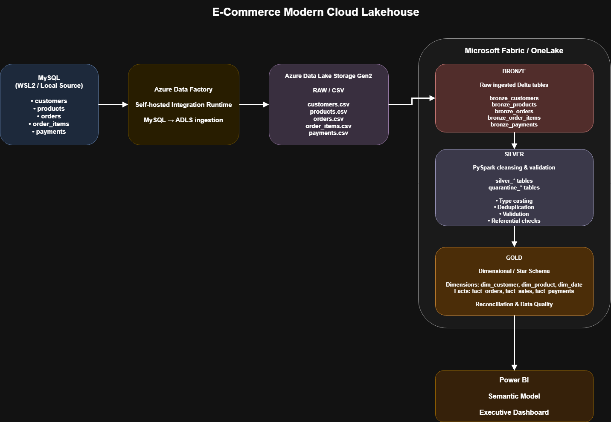

# E-Commerce Modern Lakehouse: Azure + Microsoft Fabric

End-to-end lakehouse that ingests operational MySQL data into Azure, then builds
Bronze/Silver/Gold Delta tables in Microsoft Fabric with data-quality checks.

## Architecture
MySQL (WSL) → Azure Data Factory (self-hosted IR) → ADLS Gen2 (raw, CSV)
→ Fabric Lakehouse: Bronze → Silver → Gold (Delta) → Power BI

## Data
Synthetic e-commerce data with injected quality issues:
Injected issues: duplicates, invalid emails, future dates, negative prices/amounts, orphan keys.

## Layers
- **Bronze**: raw data as ingested, plus `_ingested_at` and `_source_file`
- **Silver**: deduplicated, typed and validated; <N> bad rows quarantined
- **Gold**: star schema (dim_customer, dim_product, dim_date, fact_orders, ...) and KPIs

# Project Summary

This project demonstrates how a traditional relational e-commerce database can be transformed into a modern cloud lakehouse architecture:

**MySQL → Azure Data Factory → ADLS Gen2 → Microsoft Fabric → Bronze → Silver → Gold → Power BI**

The result is a complete data engineering and analytics pipeline with ingestion, transformation, dimensional modeling, validation, reconciliation, and business intelligence.

## Stack
Azure Data Factory, ADLS Gen2, Microsoft Fabric, PySpark, Delta Lake, SQL, Power BI, MySQL

